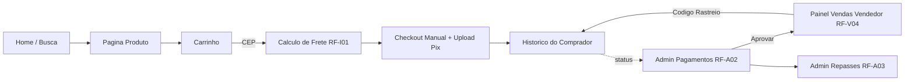

# Plano: Frontend do Marketplace MVP

## Visão geral

Implementação completa do frontend, em pasta atualmente vazia ([marketplace-frontend/](marketplace-frontend)), seguindo as duas referências:

- **Requisitos** (`documento_requisitos_mvp_marketplace_v3.pdf`): RF-C, RF-V, RF-A e RF-I01.
- **Arquitetura** (`documento_arquitetura_tecnica.pdf`): React + Vite + Tailwind + shadcn/ui + React Hook Form + Zod, organização **Feature-Based**, estado global via **Context API** (Auth + Cart) , upload `multipart/form-data` para comprovantes.

Decisões tomadas com o usuário:

- **TypeScript** como linguagem do projeto.
- **MSW (Mock Service Worker)** + DB em memória para simular toda a API real.

---

## 1. Stack final

- React 18 + Vite + TypeScript
- Tailwind CSS + shadcn/ui (Radix UI)
- React Router DOM (roteamento — citado em `app/` no doc de arquitetura)
- React Hook Form + Zod
- Axios (instância configurada em `lib/axios.ts`)
- MSW para mocks de API + faker para dados fake
- Context API (AuthContext, CartContext)
- date-fns para datas, lucide-react para ícones (padrão shadcn/ui)

---

## 2. Estrutura de pastas (Feature-Based)

Reproduz o layout do doc de arquitetura, expandido com as subpastas internas exigidas (`api/`, `components/`, `hooks/`, `routes/`):

```
marketplace-frontend/
├── public/
│   └── mockServiceWorker.js
├── src/
│   ├── app/
│   │   ├── providers/        # AuthProvider, CartProvider, ThemeProvider
│   │   ├── router/           # AppRouter, ProtectedRoute, RoleRoute
│   │   └── App.tsx
│   ├── assets/
│   ├── components/
│   │   ├── ui/               # shadcn (button, input, dialog, table, ...)
│   │   └── layout/           # Header (busca + carrinho + auth), Footer, Sidebar admin/seller
│   ├── lib/
│   │   ├── axios.ts          # instância base + interceptor JWT
│   │   ├── utils.ts          # cn() do shadcn
│   │   └── mocks/
│   │       ├── browser.ts    # setupWorker
│   │       ├── db.ts         # estado em memória (users, products, orders...)
│   │       ├── handlers/     # auth, catalog, checkout, seller, admin, shipping
│   │       └── seed.ts       # dados iniciais
│   ├── utils/                # formatCurrency, formatCpf, formatCep
│   ├── types/                # User, Product, Order, Category, Shipment...
│   └── features/
│       ├── auth/
│       ├── catalog/
│       ├── checkout/
│       ├── seller-panel/
│       └── backoffice/
├── index.html
├── package.json
├── tsconfig.json
├── tailwind.config.ts
├── vite.config.ts
└── README.md
```

Cada feature segue o mesmo molde:

```
features/<nome>/
├── api/         # funções axios (loginRequest, listProducts, ...)
├── components/  # UI específica da feature
├── hooks/       # useAuth, useCart, useProducts, ...
├── routes/      # páginas montadas no router
└── schemas/     # zod schemas (form de login, anúncio, checkout, ...)
```

---

## 3. Mapeamento Requisito → Feature → Rota

### Comprador (`features/catalog` + `features/checkout` + `features/auth`)

- **RF-C01** Cadastro/Login: `auth` → `/login`, `/registro` (formulários RHF + Zod com E-mail, Nome, CPF, Senha).
- **RF-C02** Busca/Listagem: `catalog` → `/` (Home com `SearchBar` + grid `ProductCard`) e `/busca?q=`.
- **RF-C03** Página de Produto: `catalog` → `/produto/:id` (galeria, preço, descrição, vendedor, botão Comprar).
- **RF-C04** Carrinho/Frete: `checkout` → `/carrinho` (input de CEP chama RF-I01, formulário de endereço).
- **RF-C05** Checkout manual: `checkout` → `/checkout` (exibe Pix da plataforma, total = Produto+Frete, `ReceiptUpload` em `multipart/form-data`).
- **RF-C06** Histórico: `checkout` → `/conta/pedidos` (status: Aguardando Comprovante, Em Análise, Pago, Enviado, Entregue).

### Vendedor (`features/seller-panel`)

- **RF-V01** Onboarding: `/vendedor/onboarding` (CPF/CNPJ, endereço de origem, chave Pix).
- **RF-V02** Anúncios CRUD: `/vendedor/anuncios` + `/vendedor/anuncios/novo` (Título, Descrição, Categoria, Preço, Estoque, upload de imagens).
- **RF-V03** Estoque: refletido no painel + decrementado no mock quando admin aprova pagamento.
- **RF-V04** Vendas/Despacho: `/vendedor/vendas` (campo `Código de Rastreamento` por venda aprovada).

### Administrador (`features/backoffice`)

- **RF-A01** Usuários e Categorias: `/admin/usuarios` (banir/desbanir), `/admin/categorias` (árvore com CRUD).
- **RF-A02** Conciliação (Crítico): `/admin/pagamentos` (lista de pedidos `Em Análise`, abre comprovante, botão **Aprovar Pagamento** → debita estoque + libera vendedor).
- **RF-A03** Repasses: `/admin/repasses` (cálculo `Produto + Frete - Comissão`, botão **Marcar Repasse Realizado**).

### Integração (`lib/mocks/handlers/shipping.ts`)

- **RF-I01** Cálculo de Frete: `POST /shipping/quote` no MSW recebe `{ cepOrigem, cepDestino, peso, dimensoes }` e devolve `{ valor, prazoDias, transportadora }` simulado.

---

## 4. Estado global (Context API, conforme doc)

- `AuthContext`: `user`, `token`, `role` (`buyer | seller | admin`), `login()`, `logout()`. Persistência em `localStorage`. Token injetado no `axios` via interceptor.
- `CartContext`: `items`, `address`, `shippingQuote`, `addItem`, `removeItem`, `clear`, `setAddress`, `setShipping`. Persistência em `localStorage`.
- `ProtectedRoute` + `RoleRoute` em `app/router/` para gating de rotas privadas (vendedor/admin).

---

## 5. Mocks (MSW) — chave para o MVP rodar standalone

`src/lib/mocks/db.ts` mantém arrays em memória inicializados em `seed.ts`:

- 3 usuários (1 buyer, 1 seller, 1 admin) + tokens fake JWT.
- 12 produtos em 4 categorias.
- 2–3 pedidos em estados diferentes para popular o histórico/admin.

Handlers cobrem todos os endpoints exigidos pelos requisitos:

- `auth`: `POST /auth/login`, `POST /auth/register`, `GET /auth/me`.
- `catalog`: `GET /products`, `GET /products/:id`, `GET /categories`.
- `checkout`: `POST /orders`, `POST /orders/:id/receipt` (multipart), `GET /orders/me`.
- `seller`: `GET/POST/PUT/DELETE /seller/products`, `GET /seller/sales`, `PATCH /seller/sales/:id/tracking`, `POST /seller/onboarding`.
- `admin`: `GET /admin/users`, `PATCH /admin/users/:id/ban`, `GET /admin/categories` + CRUD, `GET /admin/orders`, `POST /admin/orders/:id/approve`, `GET /admin/repasses`, `POST /admin/repasses/:id/mark-paid`.
- `shipping`: `POST /shipping/quote`.

MSW é ativado apenas em dev via `if (import.meta.env.DEV) await worker.start()` no `main.tsx`.

---

## 6. Fluxo de telas (visão geral)




---

## 7. Arquivos-chave a criar (amostra)

- `vite.config.ts` com alias `@ -> src` e plugin React.
- `tailwind.config.ts` + `src/index.css` com variáveis do shadcn (HSL theme).
- `components.json` do shadcn/ui (style: `default`, baseColor: `neutral`).
- `src/app/App.tsx`: monta `<BrowserRouter>` + `AuthProvider` + `CartProvider` + `<AppRouter />`.
- `src/lib/axios.ts`: `baseURL: '/api'`, interceptor que adiciona `Authorization: Bearer <token>`.
- `src/types/index.ts`: tipos `User`, `Product`, `Category`, `Order`, `OrderStatus`, `ShippingQuote`, `Repasse`.

---

## 8. Não-objetivos (alinhados ao doc de requisitos, seção 6)

- Sem integração real com gateway de pagamento.
- Sem split automático.
- Sem chat interno.
- Sem logística reversa automatizada.
- Sem backend real — toda persistência é em memória via MSW.

